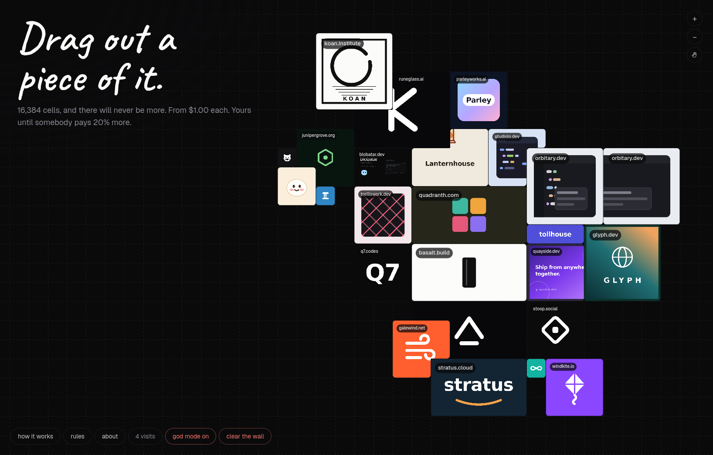

# wallid



A fixed wall of 16,384 cells. Buy a rectangle of it, put your logo in it, hold it
until somebody pays more than you did.

Prices only go up, and they go up **per cell**: a cell nobody holds costs $1, a
cell somebody holds costs 20% more than they paid. Read
[ADR 0001](docs/adr/0001-the-wall-is-bounded-and-priced-per-cell.md) before
changing anything about pricing or the size of the board — both are decisions
that cannot be revisited once people have paid.

## Running it

```sh
bun install
bun run dev        # http://localhost:3000
```

The dev server is a `Bun.serve`, not a Worker, but it runs the *same* router
over the *same* SQL and the same migrations against `bun:sqlite`, and R2 is a
directory under `.wrangler/state`. What it does not run is Cloudflare: no edge
cache, no real D1, no Turnstile latency. Reach for `bunx wrangler dev` when the
question is about the platform rather than about the wall.

With no `.dev.vars` you still get a working wall up to the point where money is
involved — Turnstile falls back to Cloudflare's published always-passes test
secret, so the challenge is verified for real, and `/wall/checkout` refuses with
"payments are not configured" rather than pretending.

To get past that point, run the wizard — it walks through the Stripe CLI, the
test secret key, a webhook signing secret and the rest of `.dev.vars`, and ends
by buying a cell with a test card:

```sh
./scripts/stripe-test-setup.sh
```

Test mode only. It refuses an `sk_live_` key outright, and never touches a
deployed Worker's secrets.

Then, whenever you are working on the buying path, a second terminal:

```sh
bun run stripe     # stripe listen --forward-to localhost:3000/wall/webhook
```

Stripe cannot reach `localhost`, so this opens a socket outward and re-posts
each test event to the local Worker route, signed the way the real one is.
Start it *before* you pay: it forwards only what happens while it is connected
and it does not backfill, so an event from a moment before it started is one it
will never mention — a payment that succeeded at Stripe and a wall that never
heard. `stripe events resend <evt_id>` is the way back from that. Run only one
at a time; a second forwarder can take over the stream and leave the first
connected and silent.

```sh
bun test           # 146 tests, including the settle path against real SQL
bun run typecheck
bun run build
```

## First deploy

```sh
./scripts/prod-setup.sh
```

Ten stages: the Cloudflare account, D1, R2, Turnstile, the wall's own secrets,
the Stripe live key, the deploy, the Stripe webhook, the www redirect, and a
verification pass that ends in buying a real cell with a real card. It creates
what is missing and leaves alone what is already there, so it is safe to re-run.

Two things it exists to get right, because both fail quietly:

**Turnstile has two values and they are not interchangeable.** The *site* key is
public and compiled into the page at **build** time (`BUN_PUBLIC_TURNSTILE_SITE_KEY`
in `.env`, see `.env.example`); the *secret* is a Worker secret read at request
time. Set the second and forget the first and the widget runs on Cloudflare's
test key while the Worker verifies against the real one — so every write is
refused with "could not verify you are human" and nothing else says why. The
wizard's last stage greps the built bundle to prove the real key shipped.

**DNS before the deploy.** `wrangler.jsonc` claims the apex and `www` as custom
domains, and Cloudflare refuses a hostname that already carries an A, AAAA or
CNAME record — so those come off first or the deploy fails on a route conflict.
`origin.ts` names the apex as canonical, so `www` needs a Redirect Rule pointing
at it; Cloudflare will not do that on its own, and two hostnames serving
identical content splits every cache in the path.

To swap Stripe between test and live afterwards is two commands and no redeploy,
since secrets apply to the running Worker immediately:

```sh
bunx wrangler secret put STRIPE_SECRET_KEY
bunx wrangler secret put STRIPE_WEBHOOK_SECRET
```

Then, in Stripe: add `https://wallid.lol/wall/webhook` as an endpoint listening
for `checkout.session.completed`, and put its signing secret in
`STRIPE_WEBHOOK_SECRET`. Locally, `bun run stripe` prints one to use instead —
the wizard above captures it for you.

DNS: `wrangler.jsonc` claims the apex and `www` as custom domains, so any A
record already on them has to be deleted first or the deploy fails on the
conflict. `origin.ts` names the apex as canonical, so add a Redirect Rule
sending `www` to it — Cloudflare will not do that on its own, and two hostnames
serving identical content splits every cache in the path.

## How many people are here

```sh
bun run pulse
```

```
  here now    12
  last hour   134
  heartbeats  1,842  (last hour)

  PT          41
  US          38
```

No script tag, nothing in the client bundle, nothing an ad blocker can remove.
The page already re-reads `/wall/i` every thirty seconds while the tab is
visible, so `worker/wall/pulse.ts` writes one Analytics Engine row from a
request that was already happening and already billed: a pseudonym and a country
code. **Here now** is distinct pseudonyms in the last ninety seconds — three
missed beats before somebody is called gone. **Last hour** counts a visitor once
however long they stayed.

The pseudonym is a keyed hash of address, user agent and *the UTC day*, so it
rotates at midnight and cannot be joined across days into a history of anybody.
The user agent is in there because two people behind one office NAT are two
visitors; neither it nor the address is stored.

Two limits worth knowing before the numbers are trusted:

**This counts the wall, not the site.** `/rules` and `/about` are served by
Cloudflare's asset pipeline and never wake a Worker — which is the arrangement
the whole deployment is built around — so a visitor who reads the rules and
leaves is not in here. Cloudflare Web Analytics, already enabled on the zone,
is where that number lives.

**Reading needs a token the Worker does not have.** `bun run pulse` queries the
Analytics Engine SQL API with `CLOUDFLARE_ACCOUNT_ID` and an account token
carrying `Account Analytics: Read` (see `.env.example`). That token can read
every dataset on the account, so it stays in `.env` and out of the deployment;
there is deliberately no route that serves these numbers, because a route means
that token in the Worker and a read quota anybody can spend by refreshing.

Free at this volume — 100,000 writes a day on the Workers free plan against a
ceiling of two per minute per open tab — and rows are kept for three months.

## How it fits together

```
src/wall/geometry.ts   the board: bounds, chunks, rectangles
src/wall/pricing.ts    the rules: what a rectangle costs and when it wins
src/wall/chunk.ts      the wire format between D1, the Worker and the canvas
src/wall/source.ts     the client's fetching and caching
src/wall/paint.ts      the canvas renderer
worker/wall/db.ts      every query, as raw prepared statements
worker/wall/index.ts   the router, and the cache headers that pay for it
worker/wall/stripe.ts  checkout, refunds, webhook signatures — over fetch
worker/wall/artwork.ts favicon fetching, upload sniffing, URL normalisation
worker/wall/pulse.ts   who is here, counted off the heartbeat the page already sends
```

`geometry.ts` and `pricing.ts` are imported by **both** sides. That is deliberate
and load-bearing: a client that quotes a price the server would refuse is a buyer
about to be surprised by their own receipt.

## Things that will look like bugs and are not

- **A stranger's claim takes up to 30 seconds to appear.** The index has a
  thirty-second TTL. Your own claim appears instantly, drawn optimistically.
- **A chunk body is cached for a year.** Its URL contains its version, so any
  write produces a new URL. The dev server strips those headers, because a dev
  database happily reuses version 1 with different contents.
- **A moderated claim keeps its cells and its prices.** Hiding is not a refund.
- **The Worker does not use the Stripe SDK.** `nodejs_compat` is off on purpose;
  see the comment at the top of `worker/wall/stripe.ts`.

## Security

A Worker that settles card payments and fetches URLs strangers type. If you
find something, [SECURITY.md](SECURITY.md) says where it goes and what is worth
reporting.

## License

[MIT](LICENSE). The code is yours to take; the wall at `wallid.lol`, the name,
and the logos people have paid to put on it are not part of it. If you deploy
your own, change the routes and the `X_HANDLE` in `origin.ts` — otherwise your
pages credit somebody else.
